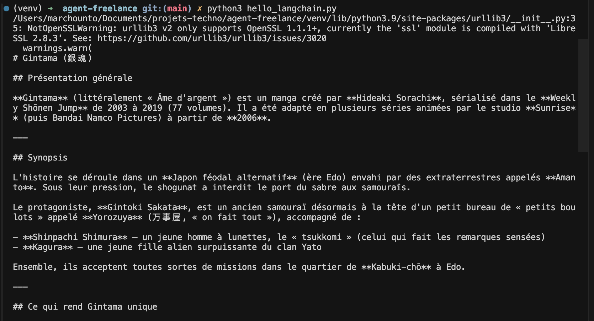
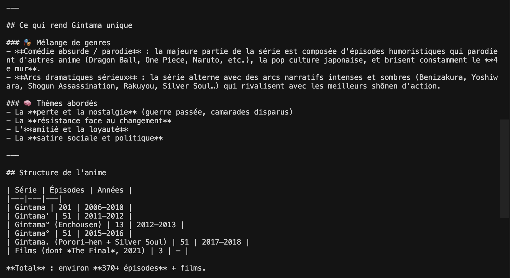
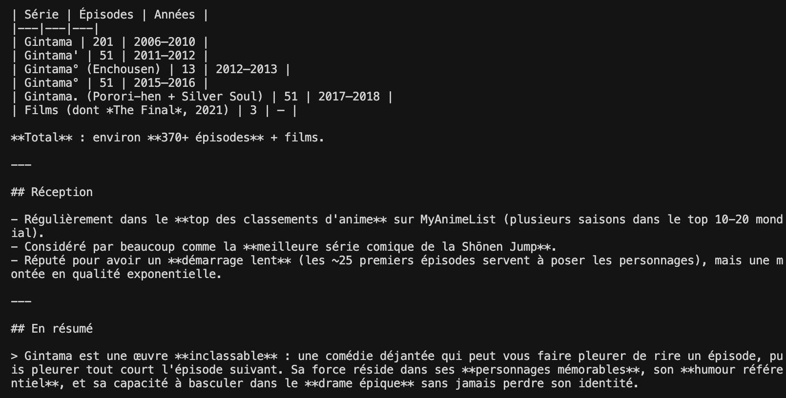

# 🤖 Agent Freelance — Apprentissage IA Agentique

Navigation rapide : [FR](#francais) | [EN](#english)

<a id="francais"></a>
## 🇫🇷 Version francaise

Serie de projets construits dans le cadre de ma transition vers le freelance en IA agentique.  
Background : Software Engineering senior | Specialisation : LangGraph · MCP · RAG

---

### 📁 Projets

#### 1. Hello Claude — Conversation multi-tours via API
Premier agent conversationnel utilisant l'API Anthropic directement.

**Ce que ca fait :**
- Appel direct a l'API Claude (claude-opus-4-6)
- Gestion de l'historique de conversation (multi-tours)
- Systeme de prompt configurable

**Stack :** Python · Anthropic API · python-dotenv

**Lancer le projet :**
```bash
python -m venv venv
source venv/bin/activate
pip install anthropic python-dotenv
python hellloClaude.py
```

#### 2. Hello LangChain — Chaine prompt → modele → parser
Premier test avec LangChain et `ChatAnthropic` pour structurer un pipeline de generation.

**Ce que ca fait :**
- Construction d'un prompt system + user avec `ChatPromptTemplate`
- Appel du modele Anthropic via `ChatAnthropic`
- Parsing texte de la reponse avec `StrOutputParser`

**Stack :** Python · LangChain · LangChain Anthropic · python-dotenv

**Lancer le projet :**
```bash
python -m venv venv
source venv/bin/activate
pip install langchain langchain-anthropic langchain-core python-dotenv
python hello_langchain.py
```

---

### 🛠️ Stack technique
- Python 3.11+
- Anthropic API / OpenAI API
- LangChain
- LangGraph (a venir)
- CrewAI (a venir)

---

### 💬 Demo — Conversation multi-tours

#### Captures d'ecran


### ✅ Resultats — Hello LangChain

#### Captures d'ecran





### 🎯 Objectif
Construire une expertise freelance en IA agentique d'ici juin 2026.

---

<a id="english"></a>
## 🇬🇧 English Version

Project series built as part of my transition to AI agent freelancing.  
Background: Senior Software Engineer | Focus: LangGraph · MCP · RAG

---

### 📁 Projects

#### 1. Hello Claude — Multi-turn conversation via API
First conversational agent using the Anthropic API directly.

**What it does:**
- Direct calls to Claude API (claude-opus-4-6)
- Conversation history management (multi-turn)
- Configurable prompt system

**Stack:** Python · Anthropic API · python-dotenv

**Run the project:**
```bash
python -m venv venv
source venv/bin/activate
pip install anthropic python-dotenv
python hellloClaude.py
```

#### 2. Hello LangChain — Prompt → model → parser chain
First LangChain experiment using `ChatAnthropic` to build a structured generation pipeline.

**What it does:**
- Builds a system + user prompt with `ChatPromptTemplate`
- Calls the Anthropic model through `ChatAnthropic`
- Parses plain text output with `StrOutputParser`

**Stack:** Python · LangChain · LangChain Anthropic · python-dotenv

**Run the project:**
```bash
python -m venv venv
source venv/bin/activate
pip install langchain langchain-anthropic langchain-core python-dotenv
python hello_langchain.py
```

---

### 🛠️ Tech stack
- Python 3.11+
- Anthropic API / OpenAI API
- LangChain
- LangGraph (coming soon)
- CrewAI (coming soon)

---

### 💬 Demo — Multi-turn conversation

#### Screenshots


### ✅ Results — Hello LangChain

#### Screenshots


### 🎯 Goal
Build strong AI agent freelancing expertise by June 2026.